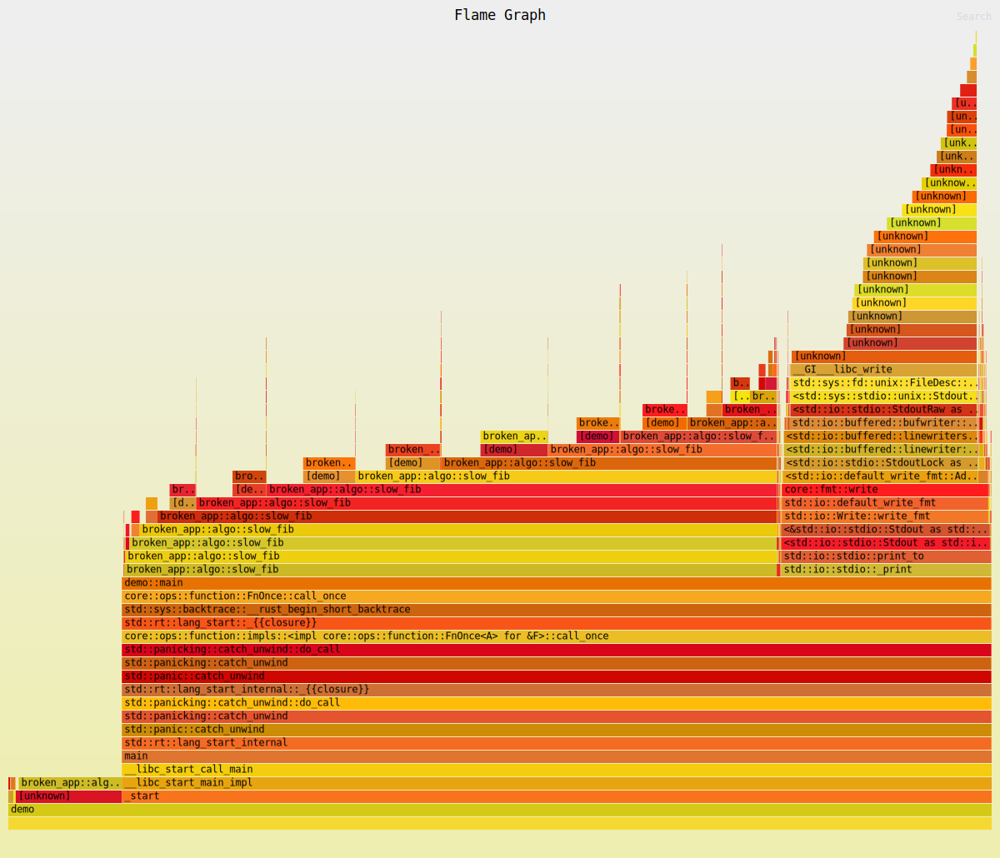

# Отчёт по профилированию

## Окружение

- Система 1:
    - MacBook Air, Apple M4
    - OS: macOS Tahoe 26.3.1 (a)
- Система 2:
    - HP Pavilion All-in-One 27, Intel Core i7-7700T
    - OC: Linux Mint 22.3
- Rust: `1.94`
- Инструменты:
    - `cargo flamegraph` + `perf`

### Команды запуска

Для более эффективного тестирования, в модуле `demo.rs` создана реализация
функции `main` с фичей `benchmark`.

```shell
cargo flamegraph --release --features benchmark --bin demo
```

### Входные данные

Для методов `even_data`, `leak_data`, `dedup_data` формируются массивы длиной
в 100 млн случайных элементов в заданном диапазоне. Сбор массивов производится
за границей основного тестирования производительности.

Метод `black_box` получает на вход значение 40.

### Результаты CPU

#### Артефакты



#### "Горячие" места

При созданных условиях наиболее "узким" местом является метод `slow_dedup`.
Текущая реализация:

```rust
pub fn slow_dedup(values: &[u64]) -> Vec<u64> {
    let mut out = Vec::new();
    for v in values {
        let mut seen = false;
        for existing in &out {
            if existing == v {
                seen = true;
                break;
            }
        }
        if !seen {
            // лишняя копия, хотя можно было пушить значение напрямую
            out.push(*v);
            out.sort_unstable(); // бесполезная сортировка на каждой вставке
        }
    }
    out
}
```

При оптимизации внедрён бинарный поиск индекса вставки, что значительно
ускорило обработку массива. По данным baseline с `9.165709ms` до `210.417µs`
(улучшение в 43 раза).
